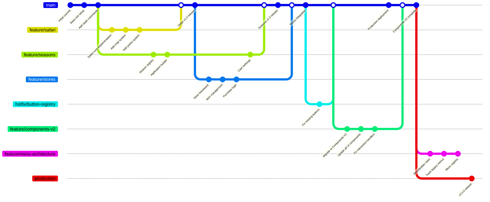
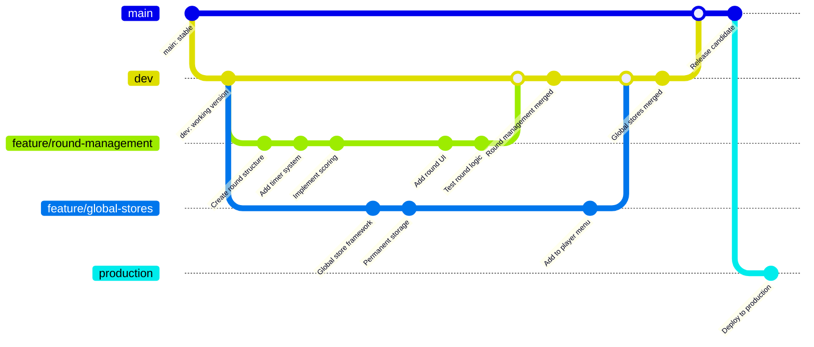

# Git Graph

## CastBot Development Branching Strategy

```mermaid
gitGraph
    commit id: "Initial commit"
    commit id: "Basic bot setup"
    commit id: "Add slash commands"
    
    branch feature/safari
    checkout feature/safari
    commit id: "Safari core implementation"
    commit id: "Add map system"
    commit id: "Add points system"
    
    checkout main
    branch feature/seasons
    checkout feature/seasons
    commit id: "Season registry"
    commit id: "Application builder"
    
    checkout main
    merge feature/safari
    commit id: "Safari v1.0 release"
    
    branch feature/stores
    checkout feature/stores
    commit id: "Store framework"
    commit id: "Item management"
    commit id: "Purchase logic"
    
    checkout feature/seasons
    commit id: "Cast rankings"
    
    checkout main
    merge feature/seasons
    commit id: "Seasons v1.0 release"
    
    merge feature/stores
    commit id: "Stores integration"
    
    branch hotfix/button-registry
    checkout hotfix/button-registry
    commit id: "Fix missing buttons"
    
    checkout main
    merge hotfix/button-registry
    
    branch feature/components-v2
    checkout feature/components-v2
    commit id: "Migrate to Components V2"
    commit id: "Update all UI components"
    commit id: "Fix interaction handlers"
    
    checkout main
    commit id: "Production deployment"
    
    merge feature/components-v2
    commit id: "Components V2 complete"
    
    branch feature/menu-architecture
    checkout feature/menu-architecture
    commit id: "MenuBuilder class"
    commit id: "Track legacy menus"
    commit id: "Menu registry"
    
    checkout main
    branch production
    checkout production
    commit id: "v2.0.0 release"
```

## Feature Branch Workflow

```mermaid
gitGraph
    commit id: "main: stable"
    
    branch dev
    checkout dev
    commit id: "dev: working version"
    
    branch feature/round-management
    checkout feature/round-management
    commit id: "Create round structure"
    commit id: "Add timer system"
    commit id: "Implement scoring"
    
    checkout dev
    branch feature/global-stores
    checkout feature/global-stores
    commit id: "Global store framework"
    commit id: "Permanent storage"
    
    checkout feature/round-management
    commit id: "Add round UI"
    commit id: "Test round logic"
    
    checkout dev
    merge feature/round-management
    commit id: "Round management merged"
    
    checkout feature/global-stores
    commit id: "Add to player menu"
    
    checkout dev
    merge feature/global-stores
    commit id: "Global stores merged"
    
    checkout main
    merge dev
    commit id: "Release candidate"
    
    branch production
    checkout production
    commit id: "Deploy to production"
```