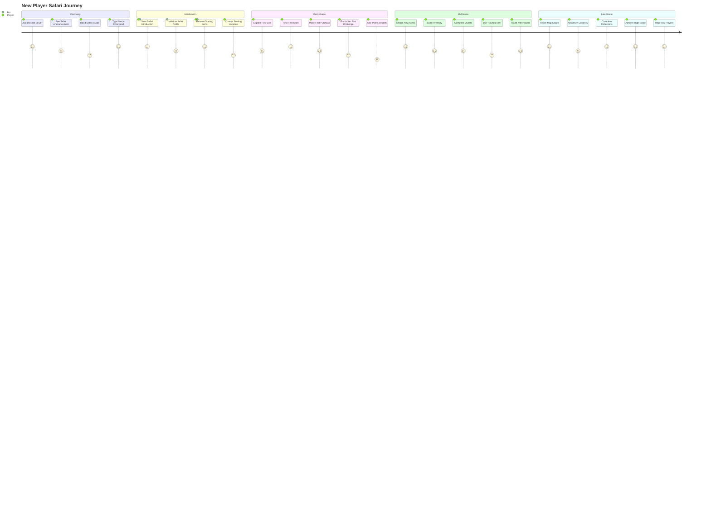
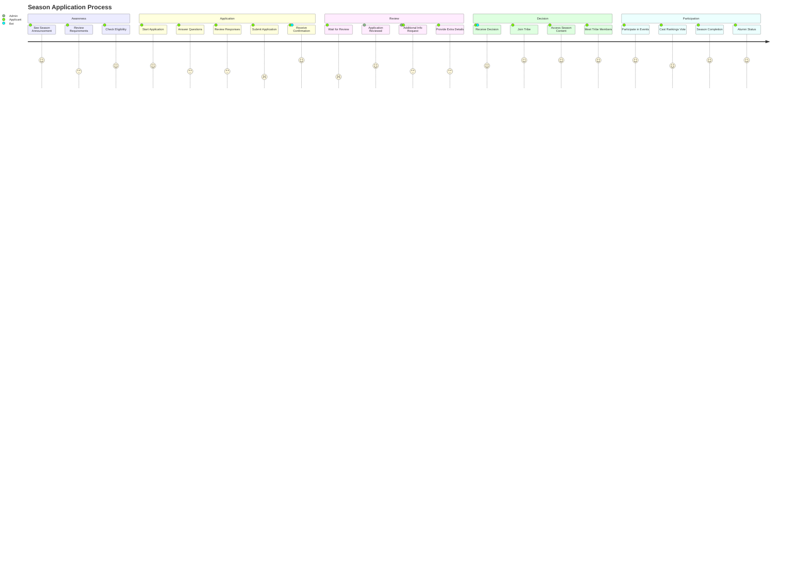
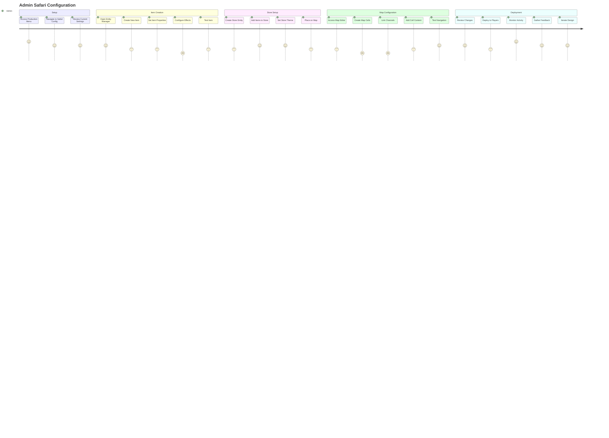

# User Journey Diagram

## New Player Safari Experience

```mermaid
journey
    title New Player Safari Journey
    
    section Discovery
      Join Discord Server: 5: Player
      See Safari Announcement: 4: Player
      Read Safari Guide: 3: Player
      Type /menu Command: 5: Player
    
    section Initialization
      View Safari Introduction: 5: Player, Bot
      Initialize Safari Profile: 4: Bot
      Receive Starting Items: 5: Player, Bot
      Choose Starting Location: 3: Player
    
    section Early Game
      Explore First Cell: 4: Player
      Find First Store: 5: Player
      Make First Purchase: 4: Player
      Encounter First Challenge: 3: Player
      Use Points System: 2: Player
    
    section Mid Game
      Unlock New Areas: 5: Player
      Build Inventory: 4: Player
      Complete Quests: 4: Player
      Join Round Event: 3: Player
      Trade with Players: 4: Player
    
    section Late Game
      Reach Map Edges: 5: Player
      Maximize Currency: 4: Player
      Complete Collections: 5: Player
      Achieve High Score: 5: Player
      Help New Players: 5: Player
```

## Application and Season Journey

```mermaid
journey
    title Season Application Process
    
    section Awareness
      See Season Announcement: 5: Applicant
      Review Requirements: 3: Applicant
      Check Eligibility: 4: Applicant
    
    section Application
      Start Application: 4: Applicant
      Answer Questions: 3: Applicant
      Review Responses: 3: Applicant
      Submit Application: 2: Applicant
      Receive Confirmation: 5: Applicant, Bot
    
    section Review
      Wait for Review: 2: Applicant
      Application Reviewed: 4: Admin
      Additional Info Request: 3: Admin, Applicant
      Provide Extra Details: 3: Applicant
    
    section Decision
      Receive Decision: 4: Applicant, Bot
      Join Tribe: 5: Applicant
      Access Season Content: 5: Applicant
      Meet Tribe Members: 5: Applicant
    
    section Participation
      Participate in Events: 5: Applicant
      Cast Rankings Vote: 4: Applicant
      Season Completion: 5: Applicant
      Alumni Status: 5: Applicant
```

## Admin Configuration Journey

```mermaid
journey
    title Admin Safari Configuration
    
    section Setup
      Access Production Menu: 5: Admin
      Navigate to Safari Config: 4: Admin
      Review Current Settings: 4: Admin
    
    section Item Creation
      Open Entity Manager: 4: Admin
      Create New Item: 3: Admin
      Set Item Properties: 3: Admin
      Configure Effects: 2: Admin
      Test Item: 3: Admin
    
    section Store Setup
      Create Store Entity: 3: Admin
      Add Items to Store: 4: Admin
      Set Store Theme: 4: Admin
      Place on Map: 3: Admin
    
    section Map Configuration
      Access Map Editor: 3: Admin
      Create Map Cells: 2: Admin
      Link Channels: 2: Admin
      Add Cell Content: 3: Admin
      Test Navigation: 4: Admin
    
    section Deployment
      Review Changes: 4: Admin
      Deploy to Players: 3: Admin
      Monitor Activity: 5: Admin
      Gather Feedback: 4: Admin
      Iterate Design: 4: Admin
```