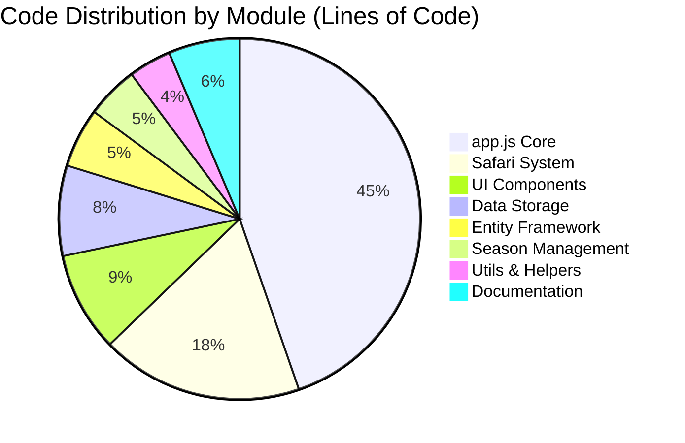
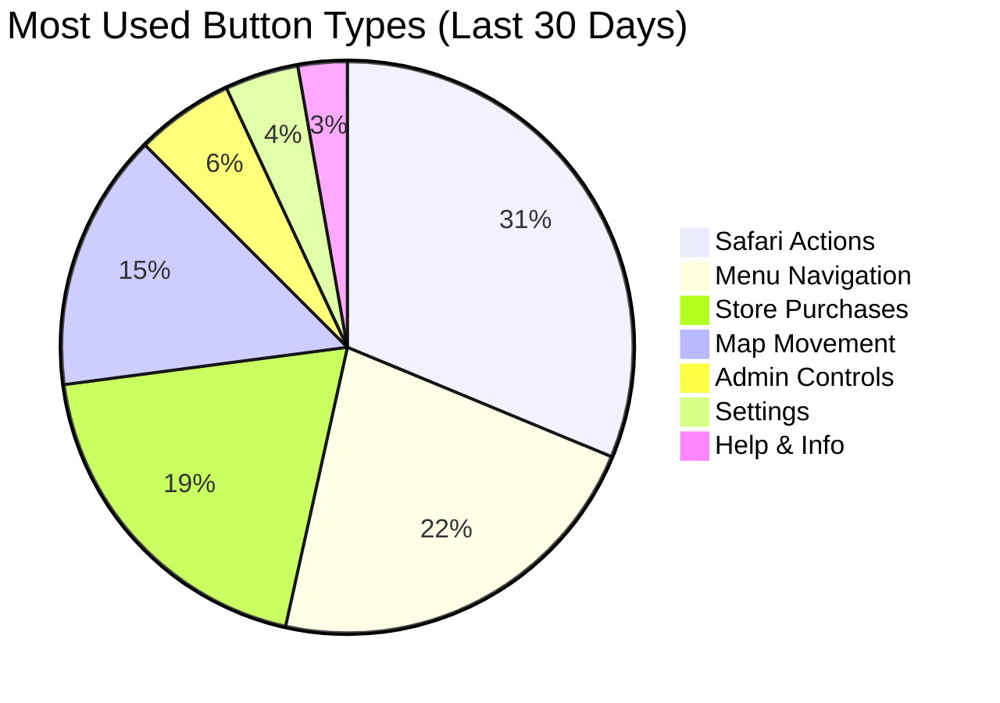
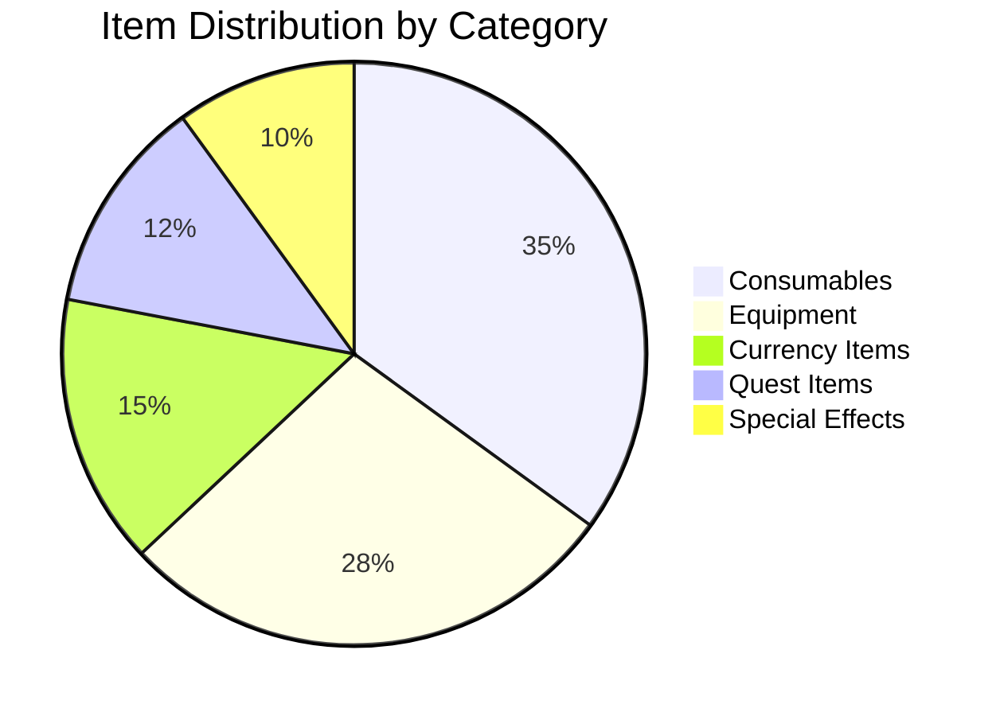
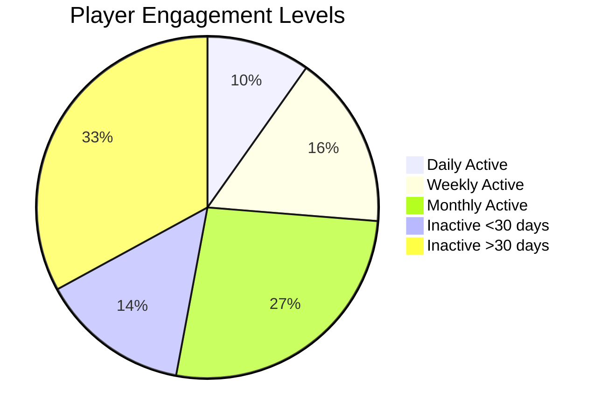
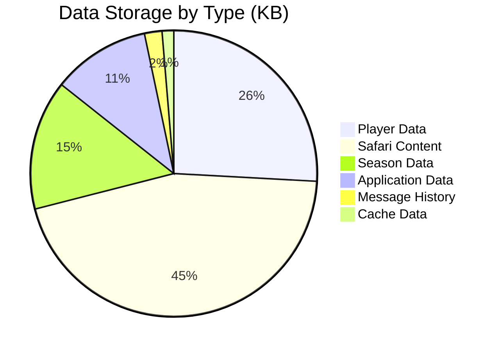
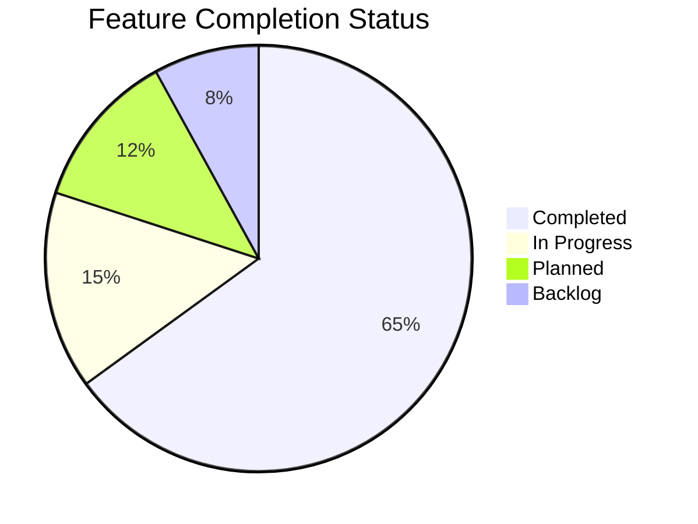
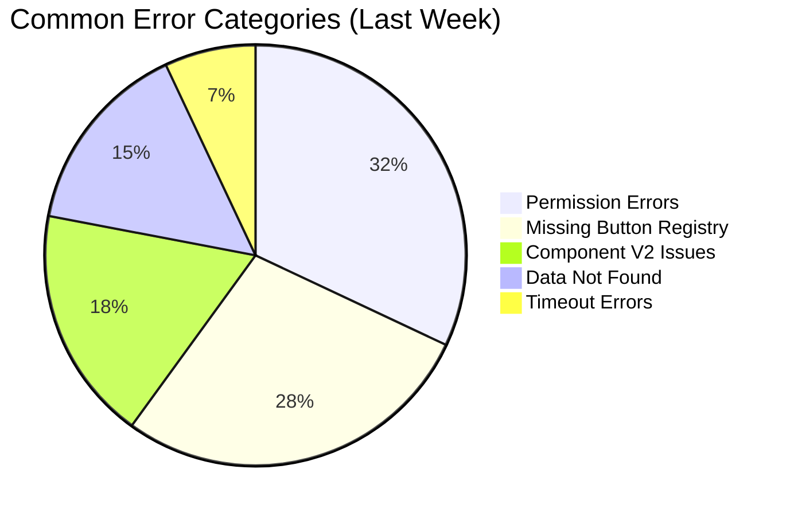

# Pie Chart

## CastBot Code Distribution

## Button Usage Analytics

## Safari Item Categories

## Player Activity Distribution

## Storage Usage Breakdown

## Feature Implementation Status

## Error Types Distribution

