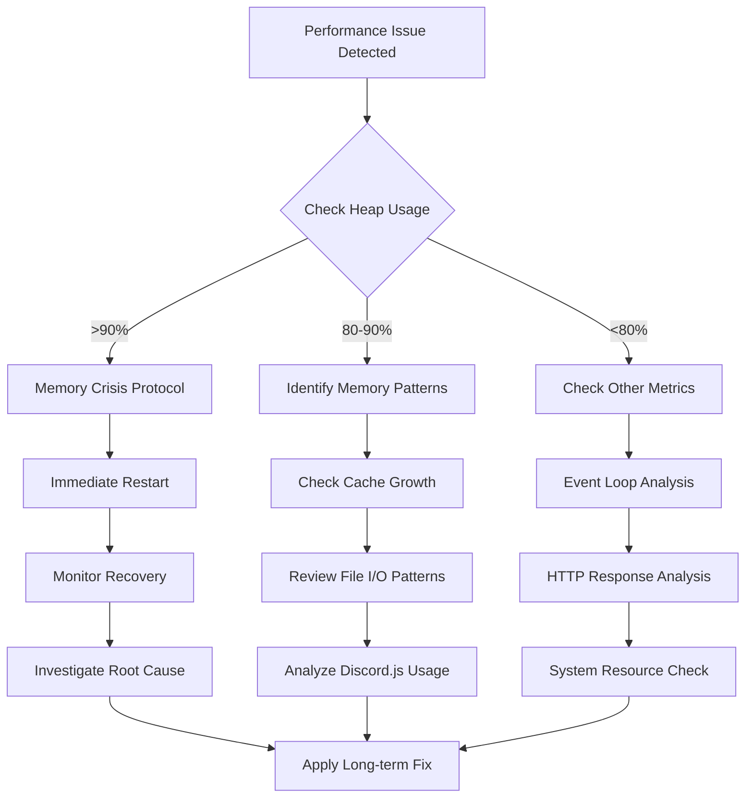
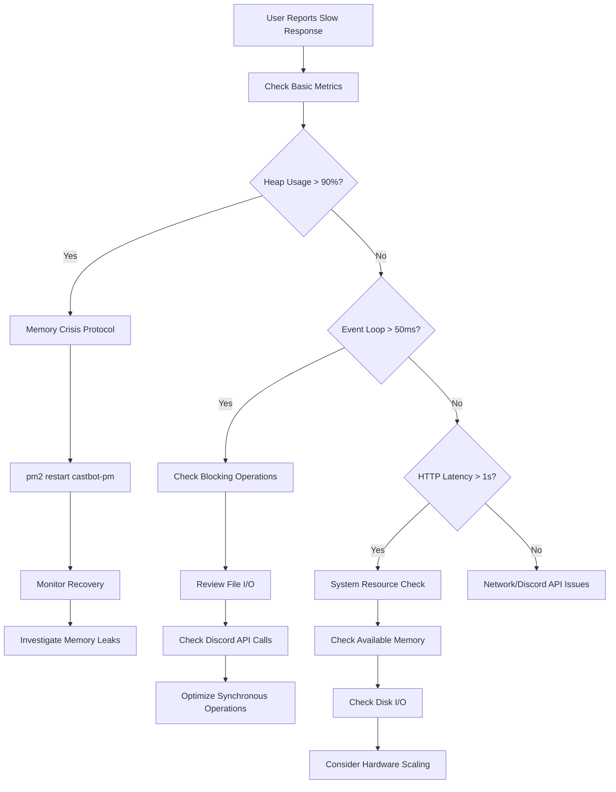

# CastBot Performance Debugging Guide

## Overview

This guide provides comprehensive procedures for diagnosing and resolving performance issues in CastBot, based on real-world production incidents and optimization work.

## 🚨 Emergency Performance Crisis Protocol

### Quick Assessment Commands

```bash
# Check current memory and performance metrics
npm run status-remote-wsl

# Get detailed PM2 process information
ssh -i ~/.ssh/castbot-key.pem bitnami@13.238.148.170 "pm2 info castbot-pm"

# Check system resources
ssh -i ~/.ssh/castbot-key.pem bitnami@13.238.148.170 "free -h && df -h"

# Monitor top memory processes
ssh -i ~/.ssh/castbot-key.pem bitnami@13.238.148.170 "ps aux --sort=-%mem | head -10"
```

### Critical Metrics to Monitor

| **Metric** | **Healthy** | **Warning** | **Critical** | **Action Required** |
|------------|-------------|-------------|--------------|-------------------|
| **Heap Usage** | <80% | 80-90% | >90% | Immediate restart |
| **Event Loop Latency P95** | <10ms | 10-50ms | >50ms | Performance optimization |
| **HTTP P95 Latency** | <200ms | 200ms-1s | >1s | System investigation |
| **Available System Memory** | >150MB | 50-150MB | <50MB | Resource scaling |
| **Swap Usage** | <50% | 50-80% | >80% | Memory crisis |

## 🔍 Root Cause Analysis Framework

### Memory Leak Investigation



### Common Memory Leak Sources

1. **Unbounded Cache Growth**
   - `Map()` objects without size limits
   - Discord.js member/role caches
   - Request caches not being cleared

2. **File I/O Inefficiencies**
   - Repeated large file reads (playerData.json: 739KB)
   - Synchronous operations blocking event loop
   - JSON parsing on every request

3. **Discord API Misuse**
   - Excessive `members.fetch()` calls
   - Force refreshing caches with `{ force: true }`
   - Accumulating event listeners

## 📊 Diagnostic Procedures

### Memory Analysis Deep Dive

```bash
# Get comprehensive memory breakdown
ssh -i ~/.ssh/castbot-key.pem bitnami@13.238.148.170 "pm2 info castbot-pm | grep -A20 'Code metrics'"

# Check for memory leaks over time
ssh -i ~/.ssh/castbot-key.pem bitnami@13.238.148.170 "pm2 logs castbot-pm | grep -E 'Heap|Memory|RSS'"

# Monitor real-time memory usage
ssh -i ~/.ssh/castbot-key.pem bitnami@13.238.148.170 "watch -n 5 'pm2 info castbot-pm | grep -A10 \"Code metrics\"'"
```

### File I/O Analysis

```bash
# Check for large files being accessed frequently
ssh -i ~/.ssh/castbot-key.pem bitnami@13.238.148.170 "find /opt/bitnami/projects/castbot -name '*.json' -exec ls -lh {} \;"

# Monitor file access patterns
ssh -i ~/.ssh/castbot-key.pem bitnami@13.238.148.170 "strace -e trace=file -p $(pgrep -f 'node.*app.js')" 2>&1 | head -20

# Check log file sizes
ssh -i ~/.ssh/castbot-key.pem bitnami@13.238.148.170 "ls -la /opt/bitnami/projects/castbot/logs/"
```

### Cache Analysis

```bash
# Look for cache-related log messages
npm run logs-prod | grep -E "cache|Cache|CACHE"

# Check for cache clearing operations
npm run logs-prod | grep -E "clear|Clear|flush|Flush"
```

## 🔧 Optimization Strategies

### Implemented Optimizations

#### 1. Server Name Caching (2025-01-22)
**Problem**: 739KB file read per interaction for server names in analytics
**Solution**: In-memory Map cache with fallback logic
**Impact**: ~98% reduction in file I/O operations

```javascript
// Added to analyticsLogger.js
const serverNameCache = new Map();

// Cache-first approach with fallback
if (!serverNameCache.has(guildId)) {
  // Only read file once per server
  const serverName = playerData[guildId]?.serverName || 'Unknown Server';
  serverNameCache.set(guildId, serverName);
}
```

#### 2. Environment-Specific Analytics Exclusions
**Problem**: No way to test analytics in development
**Solution**: Separate exclusion lists per environment
**Impact**: Better testing capabilities without production noise

#### 3. Discord.js Cache Limits (Recommended)
**Problem**: Unbounded cache growth for members, roles, messages
**Solution**: Implement cache size limits

```javascript
const client = new Client({
  intents: [...],
  makeCache: Options.cacheWithLimits({
    MessageManager: 50,
    GuildMemberManager: 200,
    RoleManager: 100,
    UserManager: 100
  })
});
```

### Performance Optimization Checklist

- [ ] **Cache Size Limits**: Discord.js cache limits implemented
- [ ] **File I/O**: Large files cached, not read repeatedly
- [ ] **Member Fetching**: Minimize `guild.members.fetch()` calls
- [ ] **Request Caching**: Clear request caches between operations
- [ ] **Log Rotation**: Prevent log files from growing unbounded
- [ ] **Memory Monitoring**: Regular heap usage checks
- [ ] **Event Loop**: Avoid blocking synchronous operations

## 🚀 Performance Recovery Procedures

### Immediate Recovery (Memory Crisis)

```bash
# 1. Restart CastBot to clear memory leaks
pm2 restart castbot-pm

# 2. Monitor recovery
pm2 info castbot-pm | grep "Heap Usage"

# 3. Check system resources
free -h
```

### Preventive Measures

```bash
# Set up memory monitoring alerts
echo "*/5 * * * * pm2 info castbot-pm | awk '/Heap Usage/ {if(\$4 > 90) print \"ALERT: High memory usage\" | \"wall\"}'" | crontab -

# Schedule regular restarts (if needed)
echo "0 4 * * 0 pm2 restart castbot-pm" | crontab -
```

## 📈 Performance Trends Analysis

### Historical Patterns

Based on production analysis (2025-01-22):
- **Memory grows** ~10-15MB per day under normal load
- **Critical threshold** reached after ~10-14 days uptime
- **Restart intervals** averaging 13 days (19 restarts in 251 days)
- **Event loop degradation** correlates with memory usage

### Monitoring Schedule

- **Daily**: Check heap usage and event loop latency
- **Weekly**: Review memory growth trends
- **Monthly**: Analyze restart frequency and causes
- **Quarterly**: Evaluate need for hardware scaling

## 🛠️ Tools and Scripts

### Available Monitoring Tools

```bash
# Production status and metrics
npm run status-remote-wsl
npm run logs-prod-follow
npm run logs-prod-errors

# SSH-based system monitoring
npm run ssh-test
ssh -i ~/.ssh/castbot-key.pem bitnami@13.238.148.170 "htop"
ssh -i ~/.ssh/castbot-key.pem bitnami@13.238.148.170 "pm2 monit"

# Analytics and usage data
npm run live-analytics
npm run server-usage-stats
```

### Custom Monitoring Scripts

Create `/scripts/monitoring/memory-check.sh`:
```bash
#!/bin/bash
HEAP_USAGE=$(pm2 info castbot-pm | grep "Heap Usage" | awk '{print $4}' | sed 's/%//')
if [ "$HEAP_USAGE" -gt 85 ]; then
  echo "WARNING: High memory usage detected: ${HEAP_USAGE}%"
  # Send alert to Discord or email
fi
```

## 📋 Performance Troubleshooting Flowchart



## 🔗 Related Documentation

- [Infrastructure Architecture](../infrastructure/InfrastructureArchitecture.md)
- [Analytics System](../infrastructure/Analytics.md)
- [Cache Management Guide](../architecture/CacheManagement.md)
- [Production Monitoring](../infrastructure/ProductionMonitoring.md)

---

*Last Updated: 2025-01-22 - Added server name caching optimization and environment-specific exclusions*