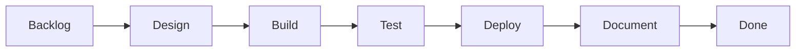

# CastBot Development Workflow

## Quick Process Overview

```mermaid
graph TD
    subgraph "Sprint Planning"
        Backlog[📋 Backlog<br/>User Stories]
        Complexity{Complexity?}
        Backlog --> Complexity
        Complexity -->|< 100 lines| Simple[BACKLOG.md]
        Complexity -->|100-500 lines| Medium[Existing .md]
        Complexity -->|> 500 lines| Complex[New .md file]
    end
    
    subgraph "Development Cycle"
        Design[🎨 Design<br/>Architecture & Limits]
        Build[🔨 Build<br/>Code & Logging]
        Test[🧪 Test<br/>Manual & Integration]
        Deploy[🚀 Deploy<br/>Production Push]
        Document[📝 Document<br/>Update Docs]
        
        Simple --> Design
        Medium --> Design
        Complex --> Design
        Design --> Build
        Build --> Test
        Test --> Deploy
        Deploy --> Document
    end
    
    subgraph "Daily Workflow"
        Start[dev-start.sh]
        Restart[dev-restart.sh<br/>"commit msg"]
        Status[dev-status.sh]
        ProdDeploy[npm run<br/>deploy-remote-wsl]
        
        Build -.-> Start
        Build -.-> Restart
        Test -.-> Status
        Deploy -.-> ProdDeploy
    end
    
    Document --> Done([✅ Done])
    
    style Backlog fill:#e3f2fd
    style Done fill:#c8e6c9
    style Deploy fill:#ffebee
```

This document defines the standard agile-devops workflow for CastBot development. All features, fixes, and enhancements should follow this process.

## Workflow Overview



## 1. Requirements Phase (Backlog)

### Entry Criteria
- User story or feature request identified
- Initial scope understood

### Process
1. **Create/Update Backlog Entry**
   - Add to BACKLOG.md with clear description
   - Include acceptance criteria
   - Assign priority (High/Medium/Low)

2. **Complexity Assessment**
   - **Simple Feature** (< 100 lines): Document in BACKLOG.md only
   - **Medium Feature** (100-500 lines): Consider dedicated section in existing .md file
   - **Complex Feature** (> 500 lines): Create dedicated .md file in docs/features/

3. **Feature Documentation Decision Tree**
   ```
   Is it a major feature/system?
   ├─ YES → Create dedicated .md file (e.g., Safari.md, SeasonAppBuilder.md)
   │   └─ Add reference in CLAUDE.md
   └─ NO → Is it part of existing system?
       ├─ YES → Add to existing .md file
       └─ NO → Document in BACKLOG.md
   ```

### Exit Criteria
- Requirements documented
- Complexity assessed
- Documentation location determined

## 2. Design Phase

### Entry Criteria
- Requirements clearly defined
- Feature assigned to sprint/development

### Process
1. **Technical Design**
   - Document architecture/solution approach
   - Identify integration points
   - Consider Discord limitations (40 components, 5 modals, etc.)
   - Plan data structures

2. **Documentation Location**
   - Simple designs: Include in BACKLOG.md entry
   - Complex designs: Add to feature's .md file under "Technical Design" section

3. **Design Review Checklist**
   - [ ] Discord API limits considered
   - [ ] Data storage approach defined
   - [ ] Error handling strategy planned
   - [ ] Security implications reviewed
   - [ ] Performance impact assessed

### Exit Criteria
- Technical design documented
- Integration points identified
- Implementation approach clear

## 3. Build Phase

### Entry Criteria
- Design approved
- Development environment ready

### Process
1. **Development Setup**
   ```bash
   ./scripts/dev/dev-start.sh "Starting work on [feature]"
   ```

2. **Coding Standards**
   - Follow existing patterns in codebase
   - Add comprehensive logging (see DefinitionOfDone.md)
   - Implement error handling
   - Update todo list as you work

3. **Regular Commits**
   ```bash
   ./scripts/dev/dev-restart.sh "WIP: [feature] - [what you just did]"
   ```

### Exit Criteria
- Feature implemented
- Code follows standards
- All Definition of Done items checked

## 4. Test Phase

### Entry Criteria
- Feature code complete
- Dev environment running

### Process
1. **Manual Testing**
   - Test happy path
   - Test error scenarios
   - Test edge cases
   - Test on mobile Discord

2. **Integration Testing**
   - Test with existing features
   - Verify no regressions
   - Check performance (< 3 second response)

3. **Documentation Testing**
   - Verify all new buttons in [ButtonHandlerRegistry.md](../enablers/ButtonHandlerRegistry.md)
   - Check that help text is accurate

### Exit Criteria
- All test scenarios pass
- No regressions identified
- Performance acceptable

## 5. Deploy Phase

### Entry Criteria
- Testing complete
- Code reviewed (self-review for solo dev)

### Process
1. **Pre-Deployment**
   ```bash
   ./scripts/dev/dev-restart.sh "Ready to deploy: [feature]"
   ```

2. **Production Deployment**
   ```bash
   npm run deploy-remote-wsl
   ```

3. **Post-Deployment**
   - Monitor logs
   - Verify feature in production
   - Watch for errors

### Exit Criteria
- Feature deployed successfully
- No production errors
- Feature working as expected

## 6. Documentation Phase

### Entry Criteria
- Feature deployed
- Working in production

### Process
1. **Update Documentation**
   - Move feature from "Product Backlog" to "As-Built" in feature .md file
   - Update CLAUDE.md if new major feature
   - Update help text/commands if needed

2. **Knowledge Transfer**
   - Ensure all handlers documented
   - Complex logic has inline comments
   - Integration points clear

### Exit Criteria
- All documentation updated
- Feature marked as complete
- Knowledge captured for future

## Sprint Planning

### Sprint Duration
- 1-2 week sprints (flexible for solo development)
- Each sprint targets one production deployment

### Sprint Structure
1. **Sprint Planning**
   - Review backlog
   - Select features for sprint
   - Update release backlog in feature .md files

2. **Daily Development**
   - Use todo list to track progress
   - Regular commits with dev-restart.sh
   - Update documentation as you go

3. **Sprint Review**
   - Deploy to production
   - Update documentation
   - Plan next sprint

## Feature Documentation Standards

### When to Create New .md Files
Create a new .md file in docs/features/ when:
- Feature is a major system (Safari, Season Applications, etc.)
- Feature has multiple sub-features
- Technical complexity requires detailed documentation
- Feature will evolve over multiple sprints

### .md File Structure Template
```markdown
# [Feature Name]

## Overview
- Objectives (admin/user perspectives)
- Solution architecture
- Integration with existing features

## Product Backlog
- Planned features not yet in sprint
- Can be high-level or detailed

## Release Backlog
- Features assigned to sprints
- Sprint 1: [Features]
- Sprint 2: [Features]

## As-Built
- Completed features moved here
- Include deployment date

## Technical Design
- Architecture details
- Data structures
- API interactions

## Implementation Notes
- Lessons learned
- Known limitations
- Future considerations
```

## Reference Management

### CLAUDE.md References
Add to CLAUDE.md when:
- New major feature/system created
- Feature has dedicated .md file
- Feature is commonly referenced

Reference format:
```markdown
**🎯 [FEATURE NAME]:** When prompts mention [keywords], refer to [docs/features/FeatureName.md] for complete documentation.
```

### Backlog References
In BACKLOG.md, point to dedicated .md files:
```markdown
### [Feature Name]
**Description:** Brief description
**Documentation:** See [docs/features/FeatureName.md] for complete documentation
**Status:** In development - see FeatureName.md for progress
```

## Development Environment

### Standard Commands
```bash
# Start development
./scripts/dev/dev-start.sh "Starting [feature] development"

# Regular saves (your new Ctrl+S)
./scripts/dev/dev-restart.sh "WIP: [what you just did]"

# Check status
./scripts/dev/dev-status.sh

# Deploy to production
npm run deploy-remote-wsl

# Clean shutdown
./scripts/dev/dev-stop.sh
```

### Git Workflow
- Work on main branch (solo development)
- Descriptive commit messages
- Regular commits (via dev-restart.sh)
- Push to GitHub frequently

## Definition of Done

See [DefinitionOfDone.md](DefinitionOfDone.md) for the complete checklist that must be completed for every feature.

## Quick Reference Decision Tree

```
New Work Item
├─ Bug Fix?
│   ├─ YES → Fix, Test, Deploy, Update BACKLOG.md
│   └─ NO → Continue
├─ Simple Feature? (< 100 lines)
│   ├─ YES → BACKLOG.md entry → Build → Test → Deploy
│   └─ NO → Continue
├─ Part of Existing System?
│   ├─ YES → Update existing .md file → Design → Build → Test → Deploy
│   └─ NO → Continue
└─ Complex New Feature?
    └─ YES → Create new .md file → Full workflow
```