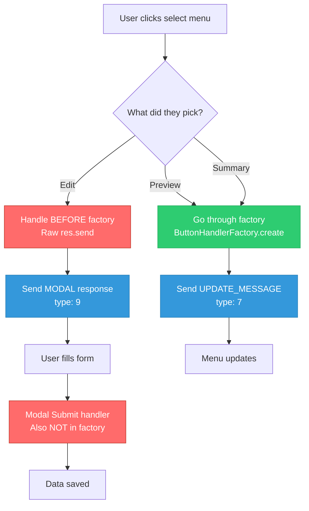
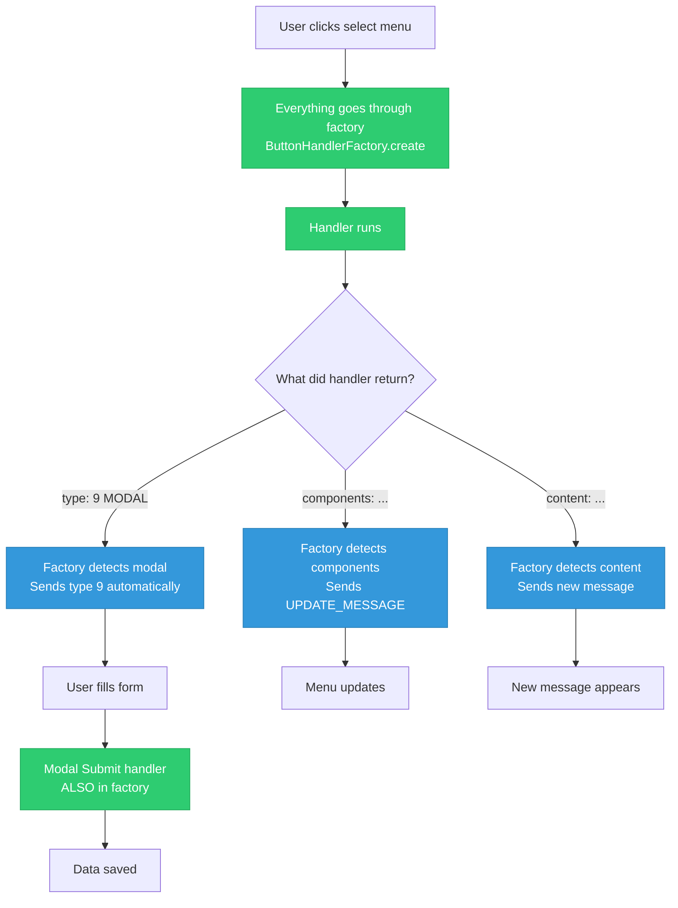
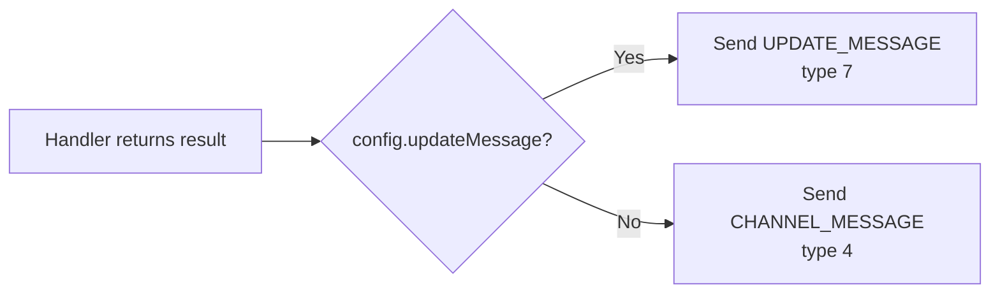
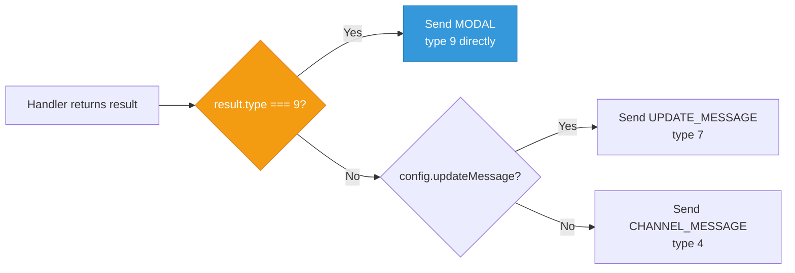

# CIF Modal Support — Current vs Proposed

## How it works NOW (the workaround)

**Red = legacy code outside factory. Green = factory. Blue = Discord response.**

The split happens BEFORE the factory even runs. The developer has to know in advance which option needs a modal, and handle it separately. Every new select menu with a modal option repeats this pattern.

---

## How it SHOULD work (auto-detect)

**Everything green. Factory handles all cases.** The handler just returns what it wants to show — modal, update, or new message — and the factory figures out the right Discord response type.

---

## The Actual Code Change (Small effort)

The factory currently does this check at response time:

We add ONE check before that:

**The orange diamond is the new code.** ~5 lines in the factory. Everything else stays the same.

---

## ELI5

**Now:** The waiter asks "are you ordering food or asking for directions?" BEFORE you sit down. If you want directions, you stand at the door. If you want food, you sit at a table. Two separate experiences.

**Proposed:** You sit at the table no matter what. The waiter brings whatever you ask for — food, directions, or a menu. The waiter figures out how to deliver it. You just ask.
